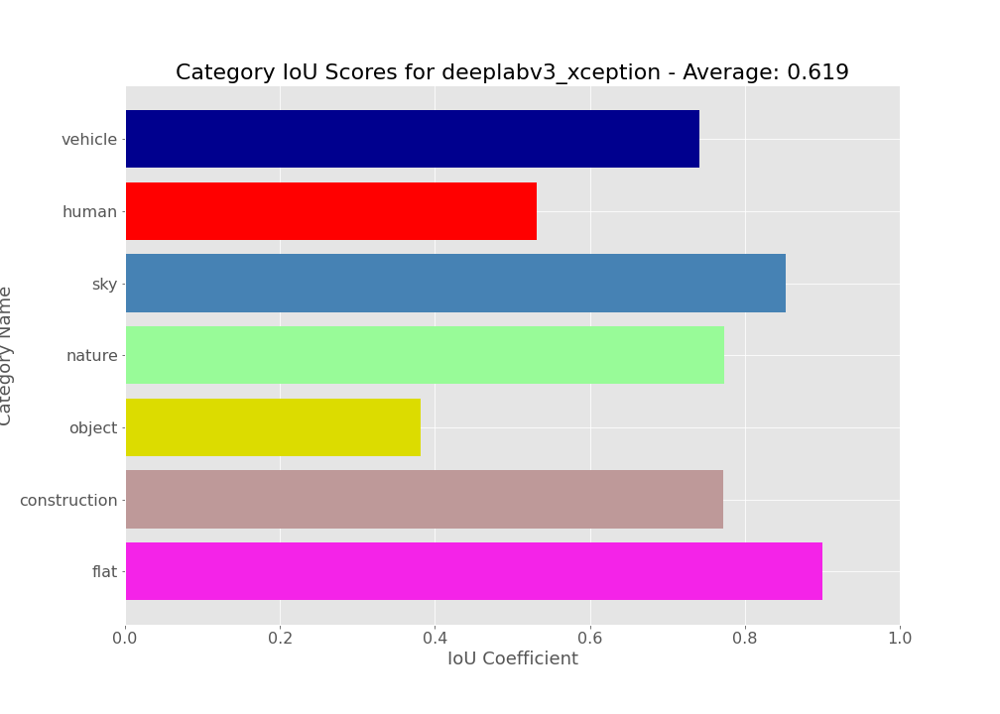

# Semantic Segmentation on Street Scenes

## 1) Download data

Steps
- Go to https://www.cityscapes-dataset.com/downloads/ (need to create an account)
- Download `gtFine_trainvaltest.zip` and `leftImg8bit_trainvaltest.zip`
- Unzip and put both into the same folder
- Delete the `test` directory inside `gtfine` and `leftImg8bit`, the annotations are dummy annotations.
- Use `data_folder_format.ipynb` to extract the raw images and annotations from each city folder, and combine them into one big folder for images and one for annotations.

## 2) Build a TFRecords Dataset for Image Segmentation

Since we're working with a dataset that is likely too large to fit into memory, we need a way to continuously stream the data from disk during training. This is done using TensoFlow's `tf.data.dataset` API, which requires us to serializing the dataset into a `.tfrecords` file.

Use `dataset_build.ipynb` to carry out this procedue, which has two main steps.

### Create a dictionary for each image/segmentation pair

We want a list of dictionaries, one for each image/mask pair. Inside each dictionary should be the unique file path as well as information about the images/mask dimensions. 

This is done using `extract_cityscape_data_info()`, which does the following:
- Extract list of image file names, shuffle list
- For each file in the list of files ...
    - Load the image into an array
    - Load the segmentation mask (same file name but .png instead of .jpg), convert to array and cast as `np.uint8`
    - Get dimensions of image and mask
    - Store location of image and mask, as well as the image dimensions and labels, inside of a dictionary
    - Append the dictionary to a list
- Returns the list of dictionaries

Partition the list into a train/test split, and record the length of each.
    
### Serialize dataset and store as TFRecord

Now we can create `.tfrecord` files for our training and test datasets. In the default implimentation, each image is converted to a `np.uint8` numpy array before being serialized. 

Some extra work is required if we want to normalize image channels. In a seperate script, read in as many images as possible, and then record the mean and standard deviation of the image rgb values over the whole dataset. Save these values to a json file in the format shown in `load_image_rgb_data()`.  Load the dictionary of channel rgb data, use it for the `rgb_data` parameter in the `write_tfrecord()`, and set `normalize=True`. 

The `write_tfrecord()` function iterates over a list of dictionaries, and performs the following steps:
- Load image and mask arrays
- Perform desired preprocessing (normalize color channels)
- Serialize image and mask into byte-strings
- Write into a file using a `tf.io.TFRecordsWriter`

### Verify by reading from TFRecord

Important note: Need to manualy specify the image depth and mask depth in `read_tfrecord()`, as well as data type. Otherwise model with throw an error during training. Also, if the images were normalized, make sure to load them as `tf.float32` arrays.

## 3) Train and Evaluate Segmentation Models

### U2Net Results for 256x512 Images

