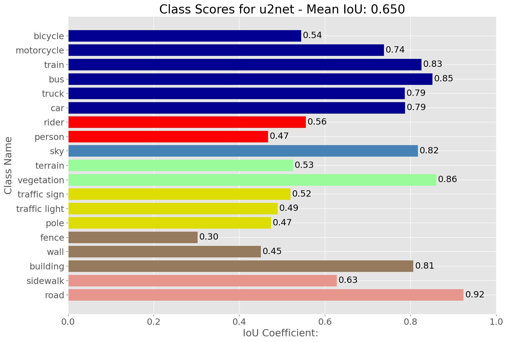
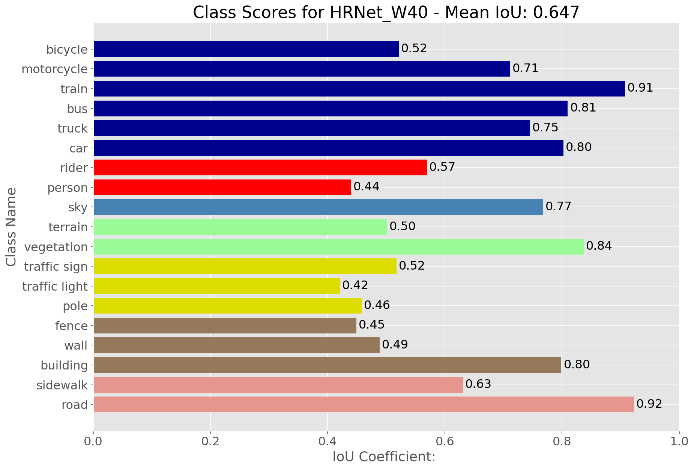

# Semantic Segmentation on Street Scenes

This repo contains scripts for training and evaluating image segmentation models on the cityscapes dataset. 

notebooks
- `create_trainId_label_imgs.ipynb`: used for configuring annotation labels
- `create_tf_records_dataset.ipynb`: used for creating a TF Records dataset from directories of images and annotations
- `data_input_pipeline_check.ipynb`: self-explanatory
- `segmentation_model_experiments.ipynb`: used for training and evaluating image segmentation models

## Results on Validation Set

Training configuration for all results
- Resolution of 512x1024
- SGD optimizer with polynomial learning rate schedule - momentum set to 0.9, initial learning rate of 0.01
- Batch size of 2 (8 would give better results if more GPU memory is available)

### U2Net 

### HRNet

